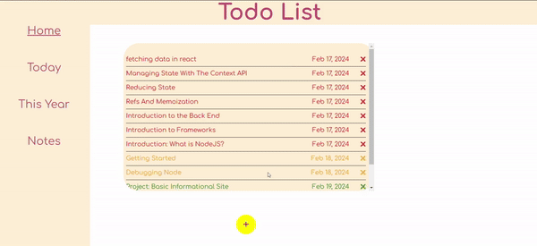

# Todo List

Live Demo : https://silanurs.github.io/todo-list/

Preview: 





## Features

* Save to-do items.

* Three priority levels to assign a to-do item.

* Pinterest style notes section. Dynamically add, remove or edit notes.

* Fully responsive.

* Data saved to local storage.


# Built with
* React
* React-Router
* styled-components


## Installation
```
git clone https://github.com/silanurs/todo-list.git
cd todo-list
npm run dev
```
